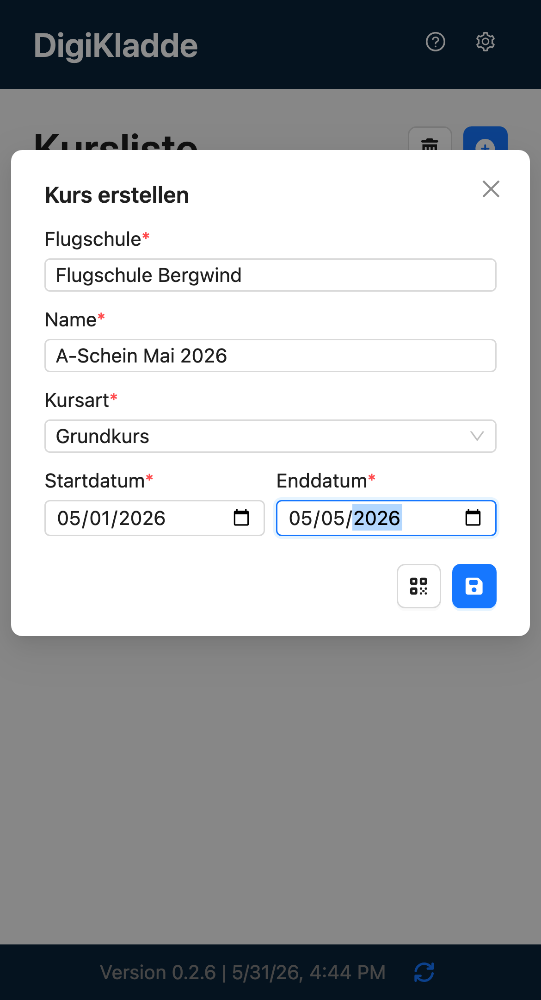
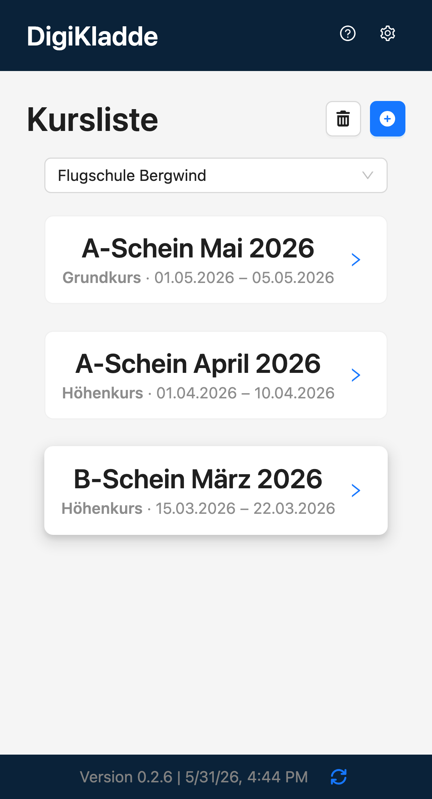
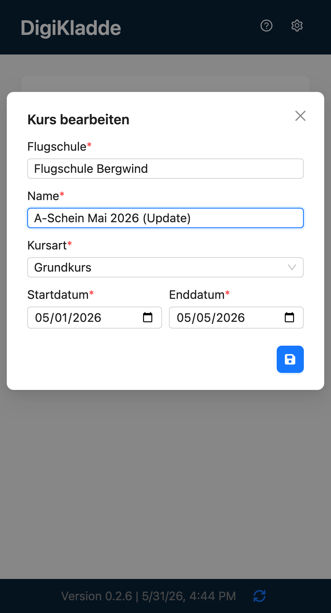
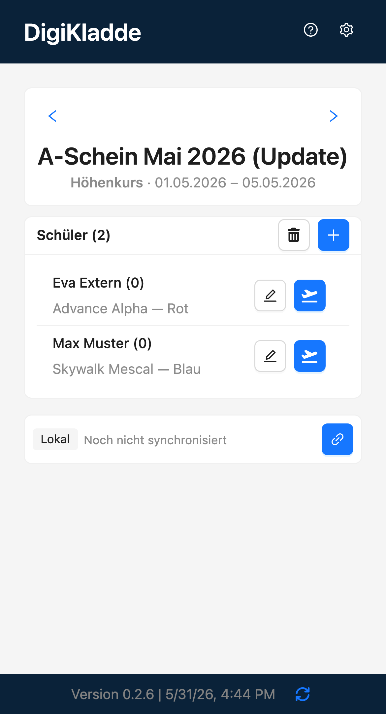
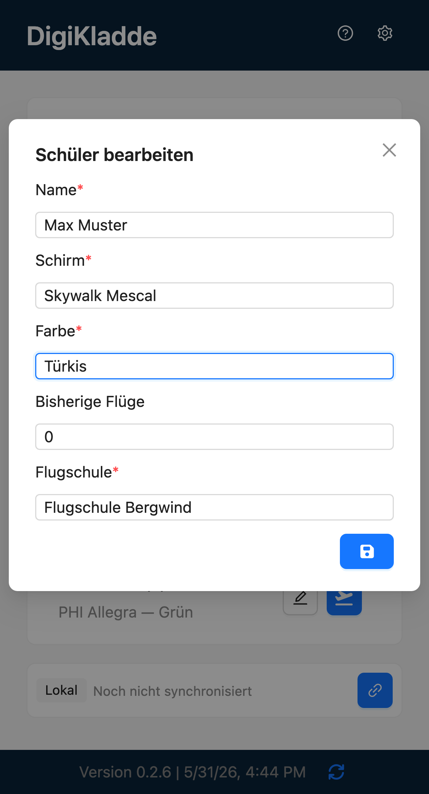
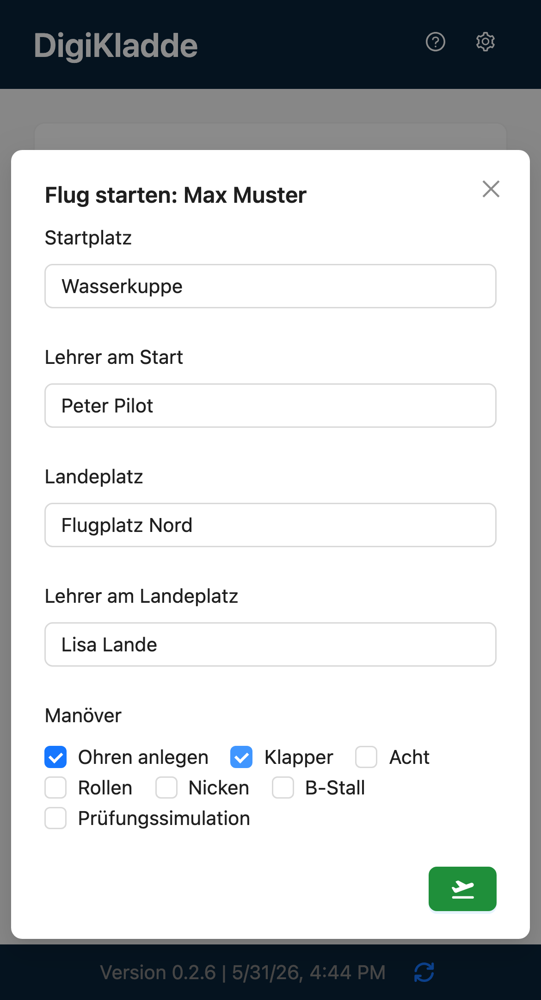
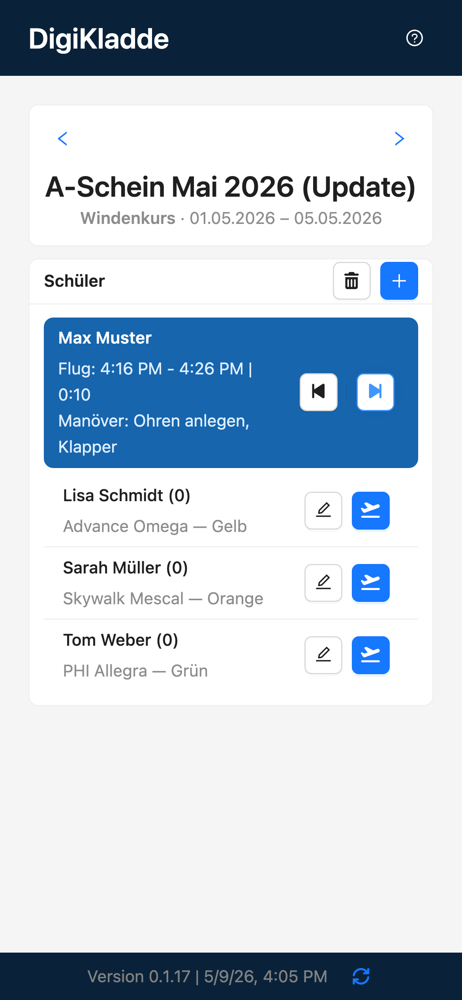

# DigiKladde - User-Guide

DigiKladde hilft dir dabei, Gleitschirm-Kurse schnell zu organisieren: Kurse anlegen, Schüler verwalten, Flüge dokumentieren und am Ende einen PDF-Kursbericht erzeugen.

## Kurzablauf mit Screenshots

### 1. Kurs erstellen
- Öffne die Kursansicht und lege einen neuen Kurs mit Name, Zeitraum und Kurstyp an.
- Speichere den Kurs.



### 2. Kurs wählen
- Wechsle in die Kursliste.
- Wähle den gewünschten Kurs aus, um ihn zu öffnen.



### 3. Kursdaten bearbeiten
- Öffne die Kursdetails.
- Passe z. B. Name, Zeitraum oder Kurstyp an und speichere die Änderungen.



### 4. Schüler hinzufügen
- Neu anlegen: Erfasse einen neuen Schüler mit den benötigten Stammdaten.
- Bestehende hinzufügen: Wähle bereits vorhandene Schüler aus.



### 5. Schüler bearbeiten und löschen
- Bearbeiten: Öffne den Schüler, passe Daten an und speichere.
- Löschen: Entferne den Schüler aus dem Kurs.



### 6. Schüler starten (inkl. Manöver)
- Starte einen Flug für den Schüler.
- Wähle die durchgeführten Manöver direkt beim Flug.



### 7. Schüler landen und Cooldown
- Beende den laufenden Flug mit Landung.
- Cooldown-Optionen:
  - Überspringen
  - In Flug zurücksetzen



### 8. Bemerkungen erfassen und vor nächstem Flug ansehen
- Hinterlege Bemerkungen zum Schüler/Flug.
- Prüfe die Bemerkungen vor dem nächsten Start.


### 9. Kursbericht ansehen und PDF erzeugen
- Oeffne die Kursbericht-Ansicht.
- Pruefe die Daten und erstelle den PDF-Report.


## Hinweis
Wenn du echte Screenshots hinzufügst, ersetze die Platzhalter durch Markdown-Bildlinks, zum Beispiel:

```md

```
