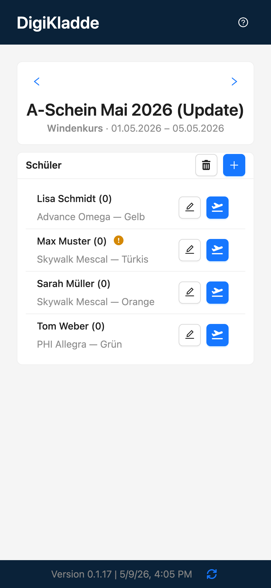
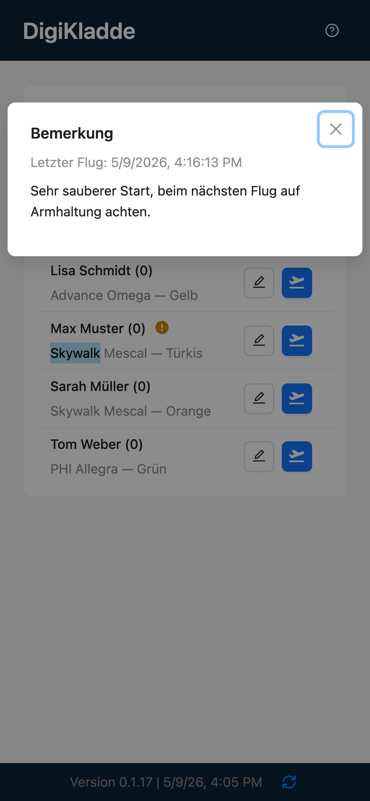
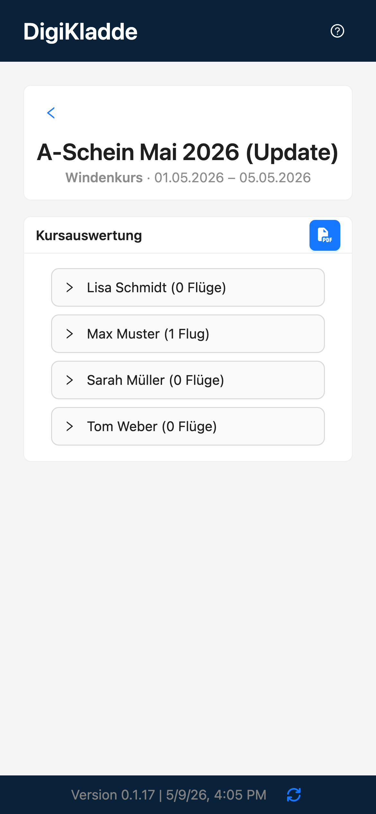

# DigiKladde - User-Guide

<table>
  <tr>
    <td valign="top" width="520">
      
DigiKladde hilft dir dabei, Gleitschirm-Kurse schnell zu organisieren: Kurse anlegen, Schüler verwalten, Flüge dokumentieren und am Ende einen PDF-Kursbericht erzeugen.

      
Das Demo-Video zeigt einen typischen Ablauf in der App: Zuerst wird aus der Kursübersicht ein neuer Kurs angelegt und direkt bearbeitet. Anschließend werden Schüler hinzugefügt, bestehende Einträge angepasst und nicht mehr benötigte Zuordnungen entfernt.

      
Im zweiten Teil startet ein Flug mit Manövern, es werden Bemerkungen erfasst, die Landung durchgeführt und der spätere Hinweis zum letzten Flug angezeigt. Zum Abschluss wechselt die Demo in die Kursauswertung und zeigt die Erzeugung des PDF-Kursberichts.

      <ul>
        <li>Kurse anlegen, bearbeiten und löschen</li>
        <li>Schüler neu erfassen, bestehenden Kursen zuordnen, bearbeiten und entfernen</li>
        <li>Flüge mit kursabhängigen Angaben und Manövern dokumentieren</li>
        <li>Landungen mit Pending-Phase verwalten und automatisch finalisieren</li>
        <li>Bemerkungen pro Flug erfassen und vor dem nächsten Flug wieder anzeigen</li>
        <li>Kursauswertung mit Flughistorie je Schüler anzeigen</li>
        <li>PDF-Kursbericht direkt aus der Auswertung erzeugen</li>
        <li>Offline-Nutzung und Update-Hinweise über die installierbare PWA</li>
      </ul>
    </td>
    <td valign="top" width="360">
      
    </td>
  </tr>
</table>

## Kurzablauf mit Screenshots

### 1. Kurs erstellen
<table>
  <tr>
    <td valign="top" width="520">
      <ul>
        <li>Öffne die Kursansicht und lege einen neuen Kurs mit Name, Zeitraum und Kurstyp an.</li>
        <li>Speichere den Kurs.</li>
        <li>Buttons im Bild: Speichern legt den Kurs an und schließt den Dialog.</li>
      </ul>
    </td>
    <td valign="top" width="360">
      
    </td>
  </tr>
</table>

### 2. Kurs wählen
<table>
  <tr>
    <td valign="top" width="520">
      <ul>
        <li>Wechsle in die Kursliste.</li>
        <li>Wähle den gewünschten Kurs aus, um ihn zu öffnen.</li>
        <li>Buttons im Bild: Plus öffnet die Kurserstellung, Papierkorb aktiviert den Löschmodus, Pfeil beziehungsweise Kartenklick öffnet den Kurs.</li>
      </ul>
    </td>
    <td valign="top" width="360">
      
    </td>
  </tr>
</table>

### 3. Kursdaten bearbeiten
<table>
  <tr>
    <td valign="top" width="520">
      <ul>
        <li>Öffne die Kursdetails mittels langem tippen auf den Kurstitel.</li>
        <li>Passe z. B. Name, Zeitraum oder Kurstyp an und speichere die Änderungen.</li>
        <li>Buttons im Bild: Der Speichern-Button im Bearbeitungsdialog übernimmt die Kursänderungen.</li>
      </ul>
    </td>
    <td valign="top" width="360">
      
    </td>
  </tr>
</table>

### 4. Schüler hinzufügen
<table>
  <tr>
    <td valign="top" width="520">
      <ul>
        <li>Neu anlegen: Erfasse einen neuen Schüler mit den benötigten Stammdaten.</li>
        <li>Bestehende hinzufügen: Wähle bereits vorhandene Schüler aus.</li>
        <li>Buttons im Bild: Plus öffnet den Dialog, die Auswahl wechselt zwischen bestehendem und neuem Schüler, Speichern fügt den Schüler dem Kurs hinzu.</li>
      </ul>
    </td>
    <td valign="top" width="360">
      
    </td>
  </tr>
</table>

### 5. Schüler bearbeiten und löschen
<table>
  <tr>
    <td valign="top" width="520">
      <ul>
        <li>Bearbeiten: Öffne den Schüler, passe Daten an und speichere.</li>
        <li>Löschen: Entferne den Schüler aus dem Kurs.</li>
        <li>Buttons im Bild: Stift öffnet die Bearbeitung, Papierkorb startet den Löschmodus und Entfernen löscht die markierten Schüler aus dem Kurs.</li>
      </ul>
    </td>
    <td valign="top" width="360">
      
    </td>
  </tr>
</table>

### 6. Schüler starten (inkl. Manöver)
<table>
  <tr>
    <td valign="top" width="520">
      <ul>
        <li>Starte einen Flug für den Schüler.</li>
        <li>Wähle die durchgeführten Manöver direkt beim Flug.</li>
        <li>Buttons im Bild: Flug starten beginnt die Aufzeichnung des Flugs mit den ausgewählten Angaben und Manövern.</li>
        <li>Doppelklick auf einen gestarteten Schüler öffnet den Bemerkungen-Dialog.
      </ul>
    </td>
    <td valign="top" width="360">
      
    </td>
  </tr>
</table>

### 7. Schüler landen und Cooldown
<table>
  <tr>
    <td valign="top" width="520">
      <ul>
        <li>Beende den laufenden Flug mit Landung.</li>
        <li>Cooldown-Optionen: Überspringen oder in Flug zurücksetzen.</li>
        <li>Buttons im Bild: Landen setzt den Flug in den Final-Status, Zurück in Flug hebt die Landung auf, Finalisieren schließt den Flug endgültig ab.</li>
        <li>Doppelklick auf einen gelandeten Schüler öffnet den Bemerkungen-Dialog.
      </ul>
    </td>
    <td valign="top" width="360">
      
    </td>
  </tr>
</table>

### 8. Bemerkungen erfassen
<table>
  <tr>
    <td valign="top" width="520">
      <ul>
        <li>Nach dem Flug werden gespeicherte Bemerkungen am Schülereintrag sichtbar markiert.</li>
        <li>So erkennst du vor dem nächsten Start sofort, dass zum letzten Flug Hinweise vorliegen.</li>
        <li>Buttons im Bild: Stift öffnet die Schülerbearbeitung, Flug starten beginnt den nächsten Flug, Warnsymbol kennzeichnet vorhandene Bemerkungen am letzten Flug.</li>
      </ul>
    </td>
    <td valign="top" width="360">
      
    </td>
  </tr>
</table>

### 9. Bemerkungen vor nächstem Flug ansehen
<table>
  <tr>
    <td valign="top" width="520">
      <ul>
        <li>Öffne die Hinweise des letzten Flugs direkt aus der Schülerliste.</li>
        <li>So kannst du die vorhandenen Bemerkungen vor dem nächsten Start noch einmal nachlesen.</li>
        <li>Buttons im Bild: In dieser Leseansicht werden nur die gespeicherten Bemerkungen angezeigt; geöffnet wird sie aus der Schülerliste per Doppeltipp auf den Eintrag.</li>
      </ul>
    </td>
    <td valign="top" width="360">
      
    </td>
  </tr>
</table>

### 10. Kursbericht ansehen und PDF erzeugen
<table>
  <tr>
    <td valign="top" width="520">
      <ul>
        <li>Oeffne die Kursbericht-Ansicht.</li>
        <li>Pruefe die Daten und erstelle den PDF-Report.</li>
        <li>Buttons im Bild: Zurück wechselt in die Kursansicht, PDF erzeugt den Kursbericht als Datei, aufklappbare Schülerzeilen zeigen die einzelnen Flüge.</li>
      </ul>
    </td>
    <td valign="top" width="360">
      
    </td>
  </tr>
</table>
